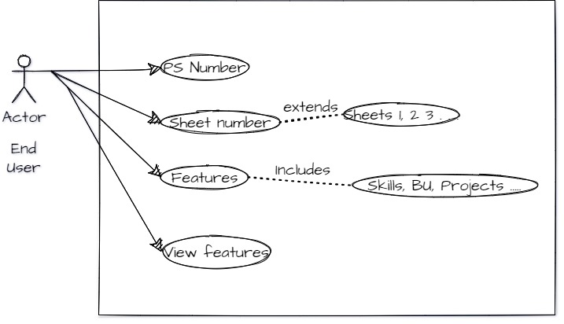

# BEHAVIOUR DIAGRAM:
Behavioral diagram shows how the system works ‘in motion’, that is how the system interacts with external entities and users, how it responds to input or event and what constraints it operates under.

## Use case UML diagram:

## Flow chart:

## Sequence diagram:

# Tools:
- Draw.io
  
