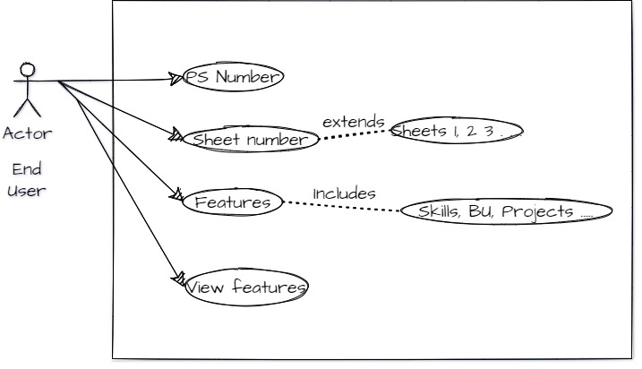

# Architecture:

## what is desighn phase ?
In the design phase, one or more designs are developed, with which the project result can apparently be achieved. Depending on the subject of the project, the products of the design phase can include dioramas, sketches, flow charts, site trees, HTML screen designs, prototypes, photo impressions and UML schemas. Here, i am going to put two structural and two behavioural diagram for SRM for better understanding

## UML Diagrams:
### BEHAVIOUR DIAGRAM:
Behavioral diagram shows how the system works ‘in motion’, that is how the system interacts with external entities and users, how it responds to input or event and what constraints it operates under.
#### Use case UML diagram:

#### Sequence Diagram:
#### Flow chat:

### STRUCTURAL DIAGRAM:
Structure diagrams depict the static structure of the elements in your system. i.e., how one object relates to another. It shows the things in the system – classes, objects, packages or modules, physical nodes, components, and interfaces. For example, just as the static aspects of a house encompass the existence and placement of such things as walls, doors, windows, pipes, wires, and vents.
#### Activity Diagram:

#### Activity Diagram:

## Tools:
- Draw.io
